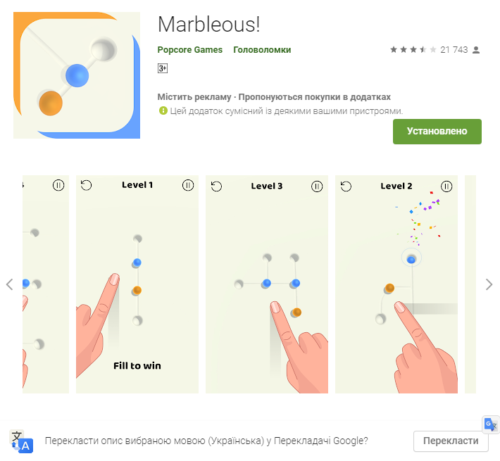
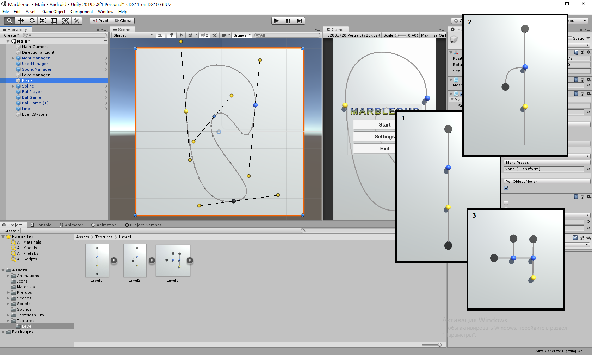

# Marbleous (2D game)

## Task:
Realise game with analog PlayMarket: https://play.google.com/store/apps/details?id=com.lwzbagsveo.marbles

Mast bee:
1) Main scene, with select levels.
2) Realise first three levels from analog (Play Market).
3) Make logic for complate levels.
4) And ather closer to original version.

## Implemented:
All

+:
1) Make Bezie-spline with gismo controll trajectory in Editor.
2) Make seting object (ball, hole) in spline points in Editor
3) Add mail sounds
4) Add controll sound level in settings

## Unity 19.2.8

